# Stocks Android App
An android app for virtual stock trading. 

## Demo
[]()

## Screen shots
### Home page

<p float="left">
  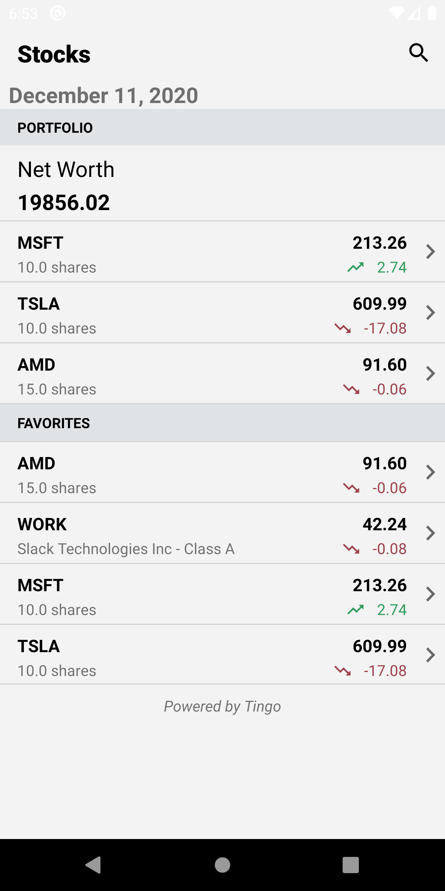
  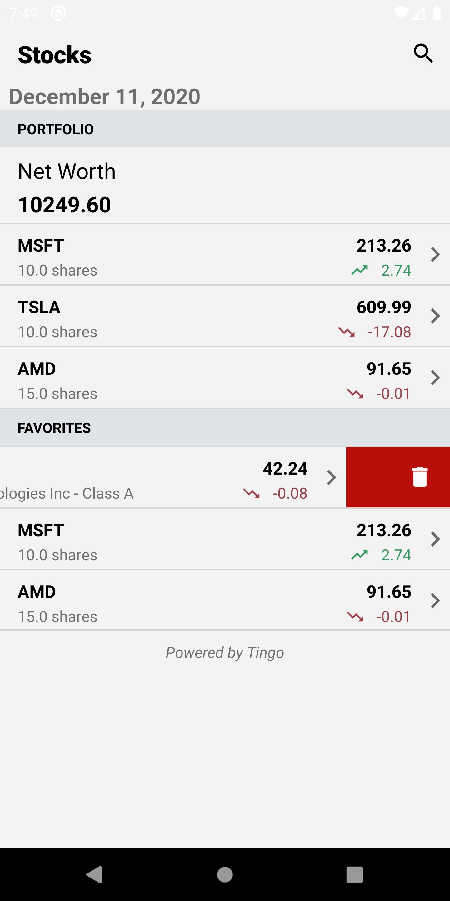
  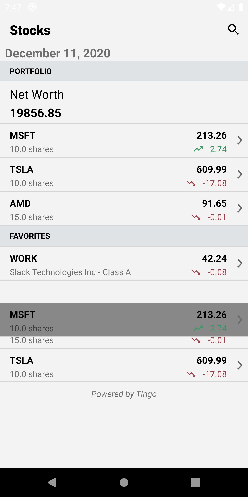
  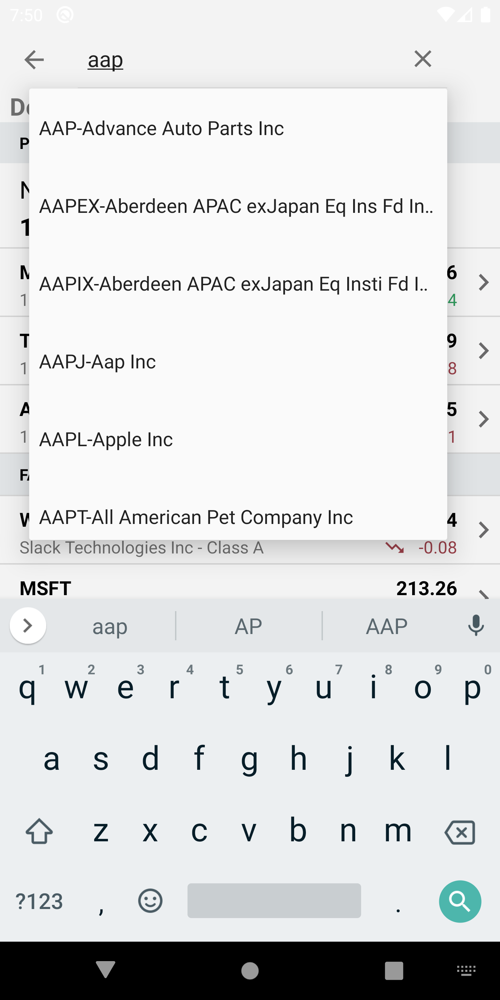
</p>


### Stock Details page
<p float="left">
  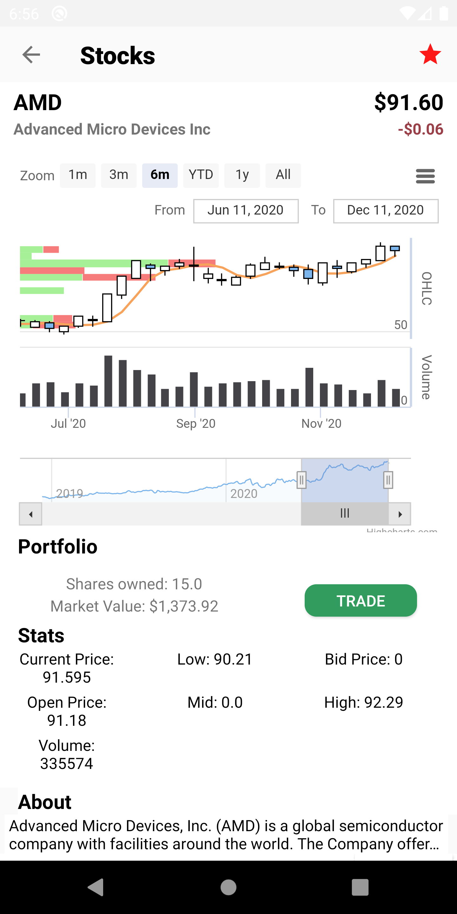
  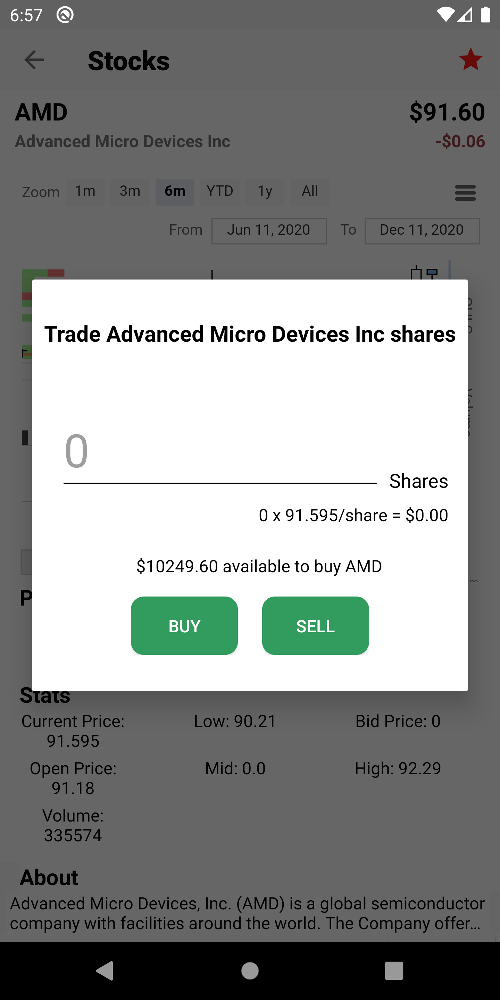
  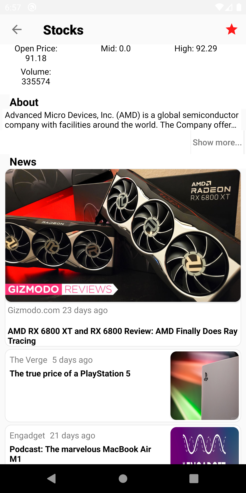
  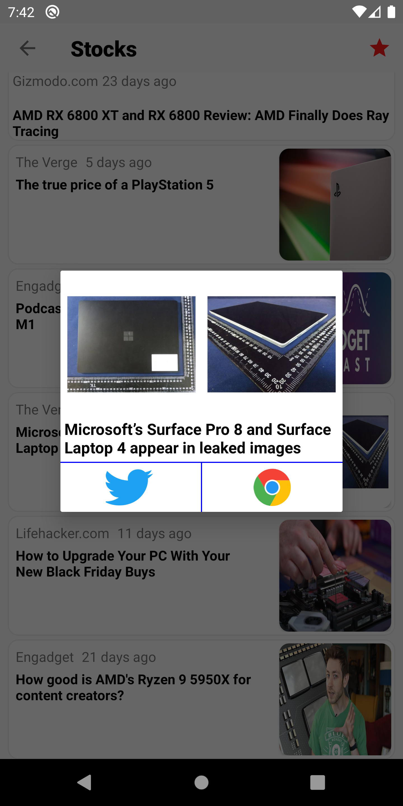
</p>


## Summary
This Android app provides a platform for stocks trading, including, features such as searching company stock details, buying/selling stocks, keeping track of stock porfolio/favorites, viewing stock SMA charts and news, allowing sharing news on twitter for a given stock. Custom Nodejs backend deployed using GCP is used for all API calls. The backend uses [Tingo API](https://api.tiingo.com/) for all stock related data, and [News API](https://newsapi.org/) for displaying stock related news. [Highcharts](https://www.highcharts.com/) is used for displaying the SMA chart data for a given ticker.


## Java File descriptions
* ```ApiCall.java```: the class that allows making api GET requests using Volley
* ```AutoSuggestApdapter.java```: Adpater used for autocomplete search feature. 
* ```Company.java```: used to create a Company object that includes the company name, ticker, number of company shares owned, last company price, price change,  
* ``` News.java```: used to create a news object that will be used to display the list of news related to given stock
* ```CompanyHeaderViewHolder.java```: the header view holder for the sectioned RecyclerView in home page. Currently we only have two sections portfolio and favorites.
* ```CompanyItemViewHolder.java```: item view holder for a given section of RecyclerView. This is used to display the company information inside either portfolio or favorites
* ```CustomDividerItemDecoration.java```: extends the DividerItemDecoration class for adding vertical lines between items in RecyclerView
* ```CustomGridAdapter.java```: extends base adpater for storing company price summary details (such as last price, previous close, volume, bid size, etc) to be displayed using gridView
* ```CustomNewsAdapter.java```: extends RecyclerView.Adapter<CustomNewsAdapter.ViewHolder> for storing a list of all news articles related for a given stock. Also contains the ViewHolder class extention of  RecyclerView.ViewHolder to be used to display these news item inside a RecyclerView
* ```MainActivity.java```: extends AppCompatActivity. The main activity of the app that acts as the home page of the app. Home page contains toolbar for searching stocks, the current date, Networth of all the stocks plus excess cash (the app starts with 20,000 cash and no stocks), and portfolio and favorites section.
* ```DetailsActivity.java```: extends AppCompatActivity. This is the stock details activity that is reached once the user clicks search icon in home page(the main activity) for a selected stock, or clicks on the company item in either protfolio or favorite section of home page. Contains stock summary, price details, options for trading this stock, and viewing stock related news article.
* ```FavoriteSection.java```: extends io.github.luizgrp.sectionedrecyclerviewadapter.Section 3rd party Android library to create favorites section inside the home page Recyclerview
* ```PortfolioSection.java```: extends io.github.luizgrp.sectionedrecyclerviewadapter.Section 3rd party Android library to create portfolio section inside the home page Recyclerview
* ```ItemMoveCallback.java```: extends ItemTouchHelper.Callback to allow rearranging the positions of company items inside portfolio or favorites section
* ``` SwipeToDeleteCallback.java```; extends ItemTouchHelper.Callback to allow removing stocks/company items from favorites sections only.
* ```LocalStorage.java```: class used to manage the company data stored in the SharedPreferences. This is used to keep track of all the company items inside either portfolio section or favorites section so if user restarts the app, the stock inside portoflio or favorites section are not lost. Reinstalling the app will however, clear the local storage (SharedPreferences)
* ```SplashActivity.java```: the very first activity that runs when the app is load. It display the app logo until the home page is loaded

## Usage
### Running the app:
* Clone the repo using `git clone https://github.com/rehmanis/stocks-android.git`
* Open the app inside [Android Studio](https://developer.android.com/studio)
* Make sure to use JDK 1.8.0 (The project uses Java 8)
* In Android Studio under `File` click `Sync project with Grade Files`.
* Add the `Pixel 2XL 28` emulator device (App has not been tested with other emulator device) [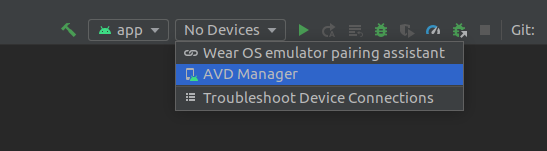](). 
* On the pop up window, click the create virtual device button and add `Pixel 2XL 28`
* Once you have successfully added the virtual device, you should see it as shown below. Now you can click the run button and it should load the emulator with the app.
[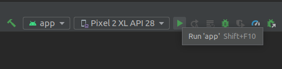]()
* The emulator will launch and will automatically open the stock app as shown below. [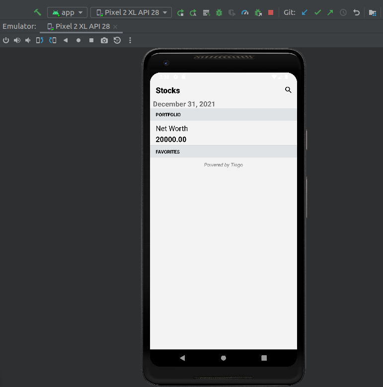]()
* Note that **no API calls will work** i.e. the auto complete or search button will not work since the backend has been removed from `Google Cloud platform (GCP)`. You might have to either deploy the backend or try to figure out how to redirect the API call to a locally run backend. The code for backend can be found [here](https://github.com/rehmanis/stocks-angular/blob/master/routes/api.js) for the one used in this app. There is also a [serverless version](https://github.com/rehmanis/CSCI571-Stocks-Serverless/blob/master/index.js) for the backend. **Note** for any API that you use such as [`News API`](https://newsapi.org/) or [`Tingo`](https://api.tiingo.com/) for stocks, you will have to generate a token/API key and replace it in the backend code. As of now the backend is using a hardcoded token for these api in the NodeJs calls (very bad practice) as can be seen [here](https://github.com/rehmanis/stocks-angular/blob/master/routes/api.js#L27) where `token=` is hardcoded.
* Places where `GCP` deployed backend API that was being used and is now removed from GCP are as follows: 
  * [DetailsActivity.java:L56-L59](https://github.com/rehmanis/stocks-android/blob/master/app/src/main/java/com/example/csci571andriodstocks/DetailsActivity.java#L56-L59)
  * [MainActivity.java:L61-L62](https://github.com/rehmanis/stocks-android/blob/master/app/src/main/java/com/example/csci571andriodstocks/MainActivity.java#L61-L62)
  


## License
MIT License

Copyright (c) 2020 Shamsuddin Rehmani

Permission is hereby granted, free of charge, to any person obtaining a copy
of this software and associated documentation files (the "Software"), to deal
in the Software without restriction, including without limitation the rights
to use, copy, modify, merge, publish, distribute, sublicense, and/or sell
copies of the Software, and to permit persons to whom the Software is
furnished to do so, subject to the following conditions:

The above copyright notice and this permission notice shall be included in all
copies or substantial portions of the Software.

THE SOFTWARE IS PROVIDED "AS IS", WITHOUT WARRANTY OF ANY KIND, EXPRESS OR
IMPLIED, INCLUDING BUT NOT LIMITED TO THE WARRANTIES OF MERCHANTABILITY,
FITNESS FOR A PARTICULAR PURPOSE AND NONINFRINGEMENT. IN NO EVENT SHALL THE
AUTHORS OR COPYRIGHT HOLDERS BE LIABLE FOR ANY CLAIM, DAMAGES OR OTHER
LIABILITY, WHETHER IN AN ACTION OF CONTRACT, TORT OR OTHERWISE, ARISING FROM,
OUT OF OR IN CONNECTION WITH THE SOFTWARE OR THE USE OR OTHER DEALINGS IN THE
SOFTWARE.
    
